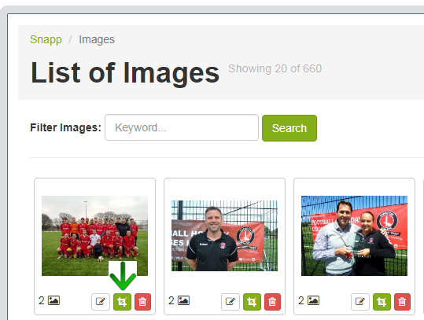
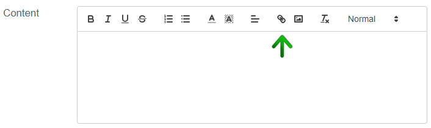

# How to include images and documents in content editors

Content editors are used on, for example, News Stories pages. 

##Attach image 

* Click "Media liabary" button. Media Library will appear on the screen
* Simply click "add image" box on the image that you wish to add.

```php
If you can't find the image you would like to add to the content this is likely due to it not being cropped to the required dimension setting. 
To resolve this go to "Images" in the Media Library, find your required image and crop (pic 1) it to the Free dimension size.   
```
    
*pic 1 - Image cropping*

* If you want the image underlinked (to make the image itself a link) 
  * Select the whole image text and click Link button next to Media Library button (pic 2), an additional window will appear on the screen.
  * Enter the full url you wish the image lead to (for example https://www.google.co.uk/)
 
   
 *pic 2 - Link button*

##Attach document
* Click the  Media button. The Media Library will appear on the screen.
* Press Documents tab (at the top of the media library pop-up)
* Simply click the document you wish to add.

* If you want to edit the title under which you will see the document on the page.
  * Go to Documents in Media Library 
  * Find your document, you can find it by name, when you're attaching the document you can see its current name.
  * Click the Edit button and change the Label field. The Document on page will appear under the Label name you have just set up.
  * click Save 

**Remember to always Save your changes.**