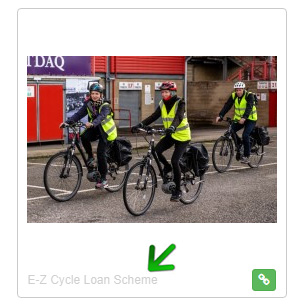

# How to setup an advert on the courses page

## To create an advert follow these steps


* Go to "Hero Units" in the Content Management section

* click on the Edit Course listing hero unit

* If there is not a slide added then add a new slide with any title and set the "Set the template" field to Course details ad. 
click Save Slide1 and Save Hero Unit. The "Attach image" button will appear on the screen

* Attach the image you would like to appear on the courses page.


```php
Note: the Image on the courses page needs to be in Snapp1-free dimension set. 
If your desired image is not available to attach go to Images in the Media Library and crop the image you want as an advert to Snapp1-free 
dimension. 
Go back to Hero Units / Course listing hero unit and when you click "Attach Image" you should see your image on the list.   
```

* Click "Save" slide button. Your advert will appear on the course details page

* If you need to attach a url address to the image then go to Media Library, find your image and edit it, then set the Link field

```php
Tip! to find the image quickly in the library you can copy the name of the attached image, (the name is next to Attach/Detach green/red icon), 
under the image in Media Library (pic 1). 
To find that name go to the chosen slider in Hero Unit and click "Attach Image", Media Library will appear on the screen, you will see your image 
then you can copy the name. 
Close Hero Unit and go back to Media Library, paste copied name into "Filter Images" box and click "Search".  
```
     
    
*pic 1 - Copying image name*