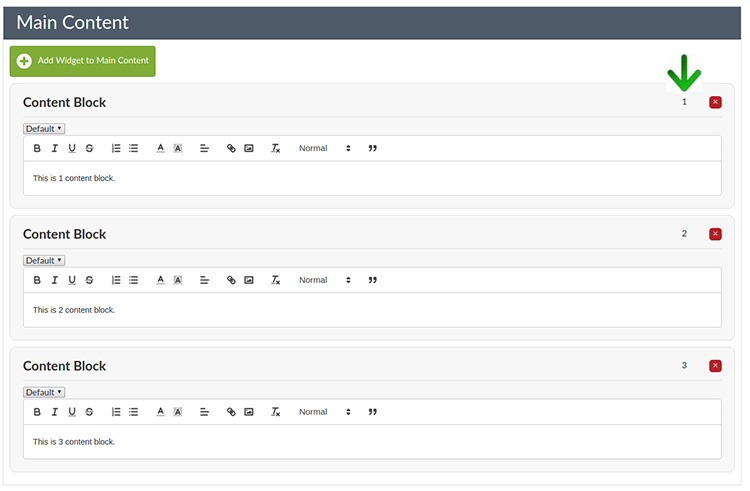

# Widgets

## How to order widgets

The advantage of the widget area is the ability to easily order and re-order them simply by assigning a number.

The order that the widgets appear on the page going down is dictated by the number assigned (this is positioned on the right of the widget - see below image).
Simply change the number to represent the order you wish it to appear. For example 1 will determine that the widget is top of the page and then the remaining widgets are assigned appropriate 
numbers after that.

    
*pic 1 - Ordering widgets*

