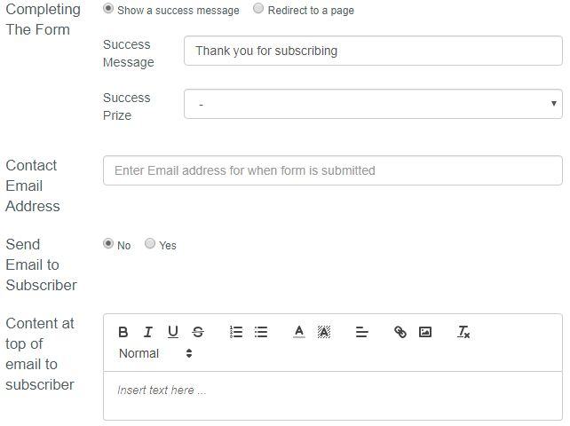

# Creating a form

## Completing The Form with custom messages and documents

If we attach a form to a page there is functionality to create what you want the user to see after completing the form. 
You can create a custom message which the user will see after completing the form. If you wish to include this message then check "Show a success message" box. 
Then fill in the "Success Message" field in Completing The form section while creating / editing a form. 

You can also include a document which the user can download after completing the form. 
To set up which document the user will see just choose the required document from the drop-down menu in "Success Prize field".   

You also have the ability to send a custom message to the user by email after completing the form. 
To do that Check box "Send Email to Subscriber" to Yes. In the field "Content at the top of the email to subscriber" you can create custom message to user. 

    
